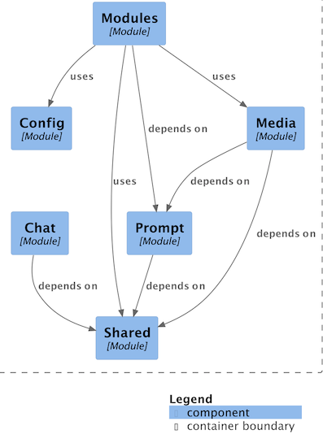

# 🎨 AI Art
Let's explore what [Spring AI](https://github.com/spring-projects/spring-ai) can bring to the creative canvas of an 
artist's tech world.  
This is a deep dive into Spring AI for an artist's toolkit.


## 🏗️ Architecture Summary

AI-Art is built on a modular Spring Boot foundation that integrates **Spring AI**, **Ollama**, **MinIO**, and **PostgreSQL (pgvector)**. 
It blends these technologies to power multimodal creativity. It processes uploaded artwork images, generates rich AI-driven descriptions, 
and converts them into **vector embeddings** for intelligent search and discovery.
Each module — **Media**, **Embeddings**, **Ingestion**, and **Shared** — plays a distinct role in analyzing, describing, 
and vectorizing artworks for intelligent storage and retrieval.

**Core Modules:**
- **🎨 Media Module** — Multimodal analysis (image + text) - Converts visual content into rich textual or semantic descriptions using multimodal models (e.g., Llava, Qwen, Gemini).
- **🧠 Embeddings Module** — Embedding generation using Spring AI’s `EmbeddingModel` - Generates and persists vector embeddings using Spring AI’s provider-agnostic `EmbeddingModel`.
- **📥 Ingestion Module** — Orchestrates image upload → description → embedding → persistence - Handles image uploads, metadata persistence, and embedding generation.
- 🧩 **Database Seeder** — Initializes artists, artworks, and embeddings for development.
- **🧩 Shared Module** — Common domain models, enums, and utility classes across the system.
- 💬 **Prompt System** — Centralizes prompt templates and supports multimodal tuning.

📘 **Learn more:**
- See the detailed [Architecture.md](docs/Architecture.md) for a deep dive into components, data flow, and testing strategy.
- Check [Wiki Pages](https://github.com/gpottepalem/ai-art/wiki) for additional details.

## 🛠️ Installation
**Make sure you have**
 * ☕ [Java 25](https://www.java.com/en/) installed, [SDK-MAN](https://sdkman.io/) is your best companion for managing multiple Java
  versions.
 * 🐳 [Docker](https://www.docker.com/) installed and running.

## 🚀 Getting Started
### [Refererence - Maven Build Commands](./MAVEN.md)
Run the following command from the project root dir:
```shell
./mvnw spring-boot:run
```

## 🧪 Testcases
### [Testcontainers](https://testcontainers.com/guides/testcontainers-container-lifecycle/)
Testcontainers is a Java library that launches the service within the Docker container, runs tests, and eventually 
destroys the container. You don’t need to worry about anything, the framework does the job.

## 🧱 Tech Stack
### 🌱 [Spring Boot](https://docs.spring.io/spring-boot/index.html)
### ✨ [Spring AI](https://docs.spring.io/spring-ai/reference/1.1/index.html)
### 🧩 [Spring Modulith](https://docs.spring.io/spring-modulith/reference/)

**Make sure you have**
 * `graphviz` installed
```shell
brew install graphviz
```
 * Install IntelliJ IDEA's [PlantUML Integration plugin](https://plugins.jetbrains.com/plugin/7017-plantuml4idea)
 * Run test-case: [ModularityTest](./src/test/java/com/giri/aiart/ModularityTest.java) which generates modulith 
   PlantUML files (.puml) under application's [./target/spring-modulith-docs](./target/spring-modulith-docs) directory.
 * When you open any [.puml](./target/spring-modulith-docs/components.puml) file generated in IntelliJ, the plugin shows
   it as PlantUML diagram.



### 🌐 [API Docs](https://smart-doc-group.github.io/)
* API documentation is generated using [smart-doc](https://smart-doc-group.github.io/) generated under `src/main/resources/static/doc`  
* Check this link: [http://localhost:63342/ai-art/static/doc/api.html](http://localhost:63342/ai-art/static/doc/api.html)
* Run the following Maven command to generate APT docs and check API doc under `src/main/resources/static/doc` (path configured in `smart-doc.json`)
```
./mvnw smart-doc:html
```

### 🐳 [Docker Compose](https://docs.docker.com/compose/)
* 🖥️ Check Docker desktop, you will have ai-art docker compose and under that the following containers up and running:
  * 🤖 [ollama](https://ollama.com/)
  * 🐉 [llava](https://ollama.com/library/llava)
  * 🐘 [pgvector](https://github.com/pgvector/pgvector)
  * 💾 [minio](https://www.min.io/)
  * 🛰️ [zipkin](https://zipkin.io/)

Once you have containers running, you can check Llava version
```shell
http :11434/api/tags
curl http://localhost:11434/api/tags|jq
```

### 🐘 [PGVector](https://github.com/pgvector/pgvector)
Vector DB

## 🌐 API end-points
* Postman doesn't support streaming.
* Use either browser, [HTTPie](https://httpie.io/), or [Curl](https://curl.se/) with stream option  
* Httpie supports [streaming](https://httpie.io/docs/cli/streamed-responses) with `--stream` option
* Curl supports [streaming](https://curl.se/docs/manpage.html#--no-buffer) with `-N` (or `--no-buffer`) option

E.g.
```shell
# Httpie
http :8080/art-master/stream           # non-streaming
http --stream :8080/art-master/stream  # streaming

# curl
 curl http://localhost:8080/art-master                                           # non-streaming
 curl -N -H "Accept: text/event-stream" http://localhost:8080/art-master/stream  # streaming
```

### 🌐 `/art-master` end-point
[Check Actuator Mappings](http://localhost:8080/actuator/mappings) and look for `/art-master`  

* `/art-master` (default)
  * HTTPie : `http :8080/art-master`
  * Curl : `http://localhost:8080/art-master`
  * Browser : http://localhost:8080/art-master
* `/art-master/stream` (default)
  * HTTPie : `http --stream :8080/art-master/stream`
  * Curl : `curl -N "http://localhost:8080/master/stream"`
  * Browser : http://localhost:8080/art-master/stream
* `/art-master/stream` (with request parameters)
  * HTTPie : `http --stream :8080/art-master/stream media=='WATERCOLOR' object=='Human Face'`
  * Curl : `curl -N "http://localhost:8080/art-master/stream?media=WATERCOLOR&object=Human%20Face"
  * Browser : http://localhost:8080/art-master/stream?media=WATERCOLOR&object=Human%20Face
* `/art-master/words/stream` (default)
  * HTTPie : `http --stream :8080/art-master/words/stream`
  * Curl : `curl -N "http://localhost:8080/art-master/words/stream"`
  * Browser : http://localhost:8080/art-master/words/stream
  
### 🌐 `/art` end-point [TODO]
* http :8080/art (http://localhost:8080/ai/art)
* http --stream :8080/ai/joke/stream (http://localhost:8080/ai/joke/stream)  
* http --stream :8080/ai/joke/stream/json (http://localhost:8080/ai/joke/stream/json)

## 🔦 [Observability](https://docs.spring.io/spring-ai/reference/observability/index.html)

🌐 Actuator Endpoint - [http://localhost:8080/actuator](http://localhost:8080/actuator)  
🌐 Metrics names - [http://localhost:8080/actuator/metrics](http://localhost:8080/actuator/metrics) - Notice gen_ai  
> **NOTE:**
> There must at least be one client operation performed (one Model request) for the following metrics to be
> listed in metrics names. 

### 🛰️ [Zipkin](https://zipkin.io/) - Distributed Tracing
* Zipkin is added for a deeper traceability.
* The Docker Compose file from Spring Initializr starts a Zipkin server at [http://localhost:9411](http://localhost:9411).
* Make a few API requests and open Zipkin UI to check traces.

> **NOTE:**
> Zipkin configuration out of the box is set to trace only 10% of requests. So, only the first request is traced and 
subsequent requests are not traced/shown.

Add the following property to `application.properties`:
```
management.tracing.sampling.probability=1.0
```
~~~
Test Note
~~~

### 📊 AI Metrics - Actuator  End-points
* How many times API is called - [http://localhost:8080/actuator/metrics/gen_ai.client.operation](http://localhost:8080/actuator/metrics/gen_ai.client.operation)
* Client operation active - [http://localhost:8080/actuator/metrics/gen_ai.client.operation.active](http://localhost:8080/actuator/metrics/gen_ai.client.operation.active)  
* Token Usage - [http://localhost:8080/actuator/metrics/gen_ai.client.token.usage](http://localhost:8080/actuator/metrics/gen_ai.client.token.usage)
